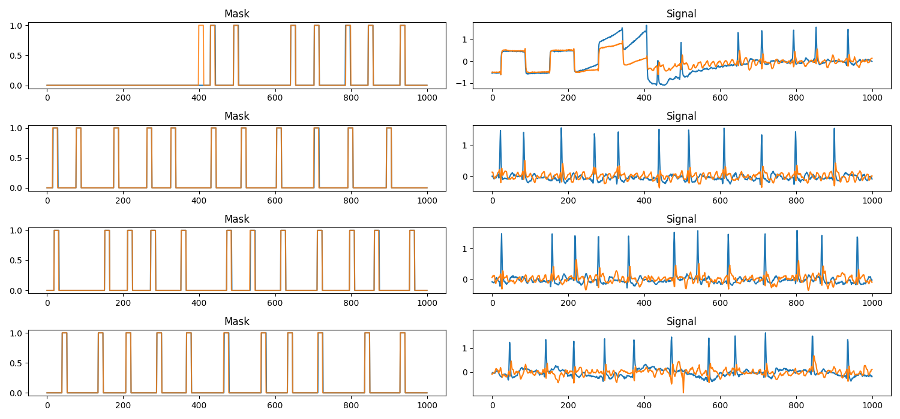

# ECG Segmentation UNet

Custom 1D UNet for segmentation-based QRS detection. Data source: https://physionet.org/content/ltafdb/1.0.0/

Processed dataset is available here: https://huggingface.co/datasets/roszcz/ecg-segmentation-ltafdb or you can run preprocessing yourself using ```python prepare_dataset.py```

## Example outputs - Classification (model trained for 1 epoch):


Left column - original mask (blue) and predicted mask (orange) \
Right column - ECG signal (2 channels)

### Training
To run training:
```sh
python train_binary_classification.py --config-name <config>
```
**--config-name** flag is used to specify config name, it needs to be in **configs** directory


## Example outputs - Distribution modelling (model trained for 1 epoch):


Left column - original mask (blue) and predicted mask (orange) \
Right column - ECG signal (2 channels)

### Training
To run training:
```sh
python train_distribution_modelling.py --config-name <config>
```
**--config-name** flag is used to specify config name, it needs to be in **configs** directory

### Code Style

This repository uses pre-commit hooks with forced python formatting ([black](https://github.com/psf/black),
[flake8](https://flake8.pycqa.org/en/latest/), and [isort](https://pycqa.github.io/isort/)):

```sh
pip install pre-commit
pre-commit install
```

Whenever you execute `git commit` the files altered / added within the commit will be checked and corrected.
`black` and `isort` can modify files locally - if that happens you have to `git add` them again.
You might also be prompted to introduce some fixes manually.

To run the hooks against all files without running `git commit`:

```sh
pre-commit run --all-files
```
