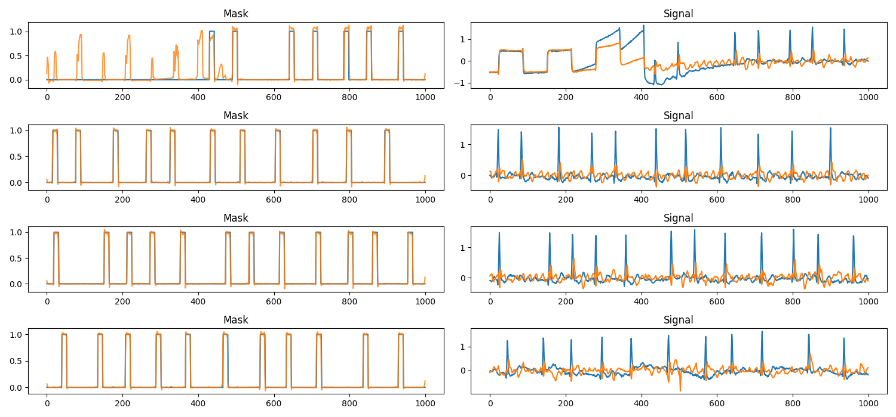

# ECG Segmentation UNet

Custom 1D UNet for segmentation-based QRS detection. Data source: https://physionet.org/content/ltafdb/1.0.0/

Processed dataset is available here: https://huggingface.co/datasets/roszcz/ecg-segmentation-ltafdb or you can run preprocessing yourself using ```python prepare_dataset.py```

### Example outputs - Classification (model trained for 1 epoch):


Left column - original mask (blue) and predicted mask (orange) \
Right column - ECG signal (2 channels)

### Example outputs - Distribution modelling (model trained for 1 epoch):


Left column - original mask (blue) and predicted mask (orange) \
Right column - ECG signal (2 channels)

### Training
To run training:
```sh
python train.py --config-name <config>
```
**--config-name** flag is used to specify config name, it needs to be in **configs** directory

### Example config file
```yaml
hydra:
  job:
    chdir: False

train:
  task: "binary-classification"
  dataset_name: "roszcz/ecg-segmentation-ltafdb" # huggingface dataset
  batch_size: 128
  num_workers: 8
  lr: 3e-4
  weight_decay: 0.01
  num_epochs: 1
  device: "cuda"
  precision: "16-mixed" # not implemented yet
  overfit_batches: 0

paths:
  save_ckpt_dir: "checkpoints" # directory where checkpoints will be saved
  load_ckpt_path: null # if not None, specifies path to model state dict which will be loaded
  log_dir: "logs"

unet:
  in_channels: 2 # image channels
  out_channels: 1
  kernel_size: 7
  dim: 32 # initial number of unet channels (will be multiplied by dim_mults)
  dim_mults: [1, 2, 4]
  num_resnet_groups: 4

logger:
  run_name: run-${now:%Y-%m-%d-%H-%M}
  log_every_n_steps: 50

```

### Testing
If you wish to test model you can run sample test scripts located tests directory.

```sh
python tests/unet_classification_test.py
```
or
```sh
python tests/unet_distribution_modelling_test.py
```
Both scripts use checkpoints that can be downloaded from Hugging Face: https://huggingface.co/JasiekKaczmarczyk/ecg-segmentation-unet

### Code Style

This repository uses pre-commit hooks with forced python formatting ([black](https://github.com/psf/black),
[flake8](https://flake8.pycqa.org/en/latest/), and [isort](https://pycqa.github.io/isort/)):

```sh
pip install pre-commit
pre-commit install
```

Whenever you execute `git commit` the files altered / added within the commit will be checked and corrected.
`black` and `isort` can modify files locally - if that happens you have to `git add` them again.
You might also be prompted to introduce some fixes manually.

To run the hooks against all files without running `git commit`:

```sh
pre-commit run --all-files
```
